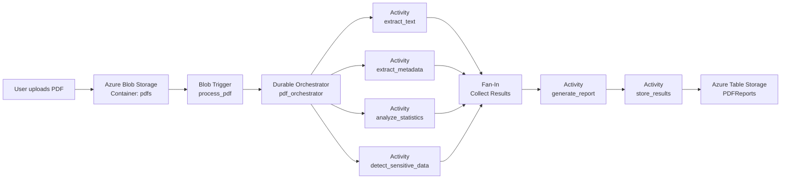

# CST8917-lab5: Serverless Mid Term project

**Student Name**: Faiza Boudehane
**Student ID**: 041273470
**Course**: CST8917 Serverless
**Group**: Alone
---

## Demo Video

🎥 [Watch Demo Video](https://youtu.be/ZIqKsyLVnug)

---

## Diagram

# PDF Analyzer - Architecture Diagram

## Overview

This project is an Azure Durable Functions application that automatically analyzes PDF documents uploaded to Azure Blob Storage.

It demonstrates the following Azure serverless patterns:

- Blob Trigger
- Durable Functions Orchestration
- Fan-Out / Fan-In
- Chaining
- Azure Table Storage

---

# Architecture



---

# Project Architecture

```text
pdf-analyzer/
│
├── activities/
│   ├── extract_text.py
│   ├── extract_metadata.py
│   ├── analyze_statistics.py
│   ├── detect_sensitive_data.py
│   ├── generate_report.py
│   └── store_results.py
│
├── function_app.py
│
├── host.json
├── local.settings.json
├── requirements.txt
│
└── README.md
```

---

# Execution Flow

```text
Upload PDF
      │
      ▼
Blob Trigger (process_pdf)
      │
      ▼
Start Durable Orchestrator
      │
      ▼
Fan-Out
 ├───────────────┐
 │               │
 ▼               ▼
Extract Text     Extract Metadata
 │               │
 ▼               ▼
Analyze Statistics
 │
 ▼
Detect Sensitive Data
 └───────────────┐
                 │
                 ▼
            Fan-In
                 │
                 ▼
         Generate Report
                 │
                 ▼
        Store in Table Storage
```

---

# Durable Functions Pattern


A[Blob Trigger]

A --> B[Durable Orchestrator]

B --> C1[Extract Text]
B --> C2[Extract Metadata]
B --> C3[Statistics]
B --> C4[Sensitive Data]

C1 --> D
C2 --> D
C3 --> D
C4 --> D

D[Merge Results]

D --> E[Generate Report]

E --> F[Store Results]
```

---

# Azure Services Used

| Azure Service | Purpose |
|---------------|---------|
| Azure Blob Storage | Stores uploaded PDF files |
| Blob Trigger | Detects new PDF uploads |
| Azure Durable Functions | Coordinates workflow |
| Activity Functions | Perform PDF analysis |
| Azure Table Storage | Stores final analysis report |
| Azurite | Local Azure Storage emulator |

---

# Fan-Out / Fan-In Pattern

```
              Orchestrator
                    │
      ┌─────────────┼─────────────┐
      │             │             │
      ▼             ▼             ▼
 Extract Text   Metadata    Statistics
      │
      ▼
 Sensitive Data
      │
      └─────── Fan-In ───────►
                    │
                    ▼
             Generate Report
                    │
                    ▼
            Store Results
```

---

# Workflow Summary

1. User uploads a PDF into the **pdfs** Blob Storage container.
2. The **process_pdf** Blob Trigger starts the Durable Function orchestration.
3. The **pdf_orchestrator** launches four activities in parallel:
   - Extract text
   - Extract metadata
   - Analyze statistics
   - Detect sensitive data
4. The orchestrator waits until all activities finish (Fan-In).
5. The combined results are sent to **generate_report**.
6. The generated report is passed to **store_results**.
7. The final report is saved into the **PDFReports** Azure Table Storage table.
